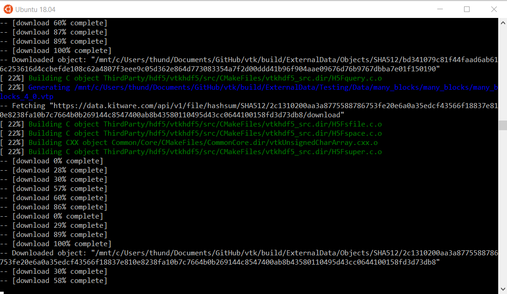
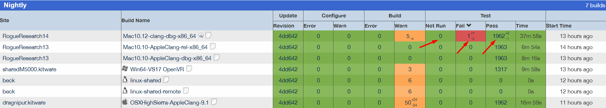
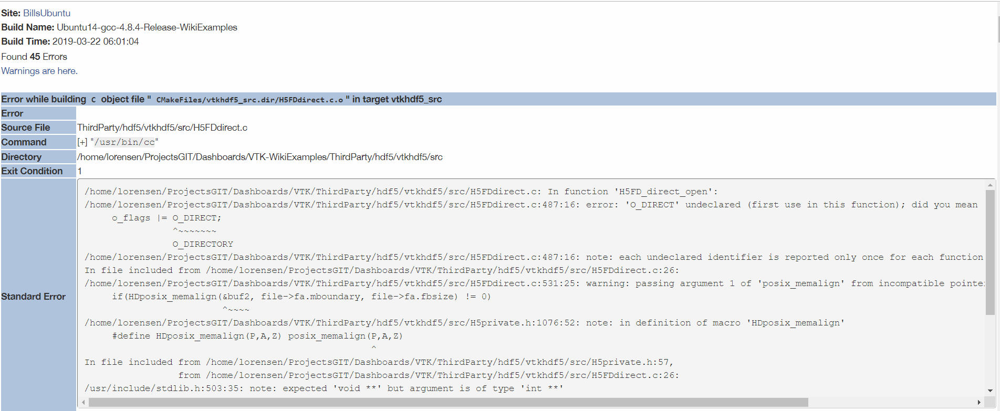
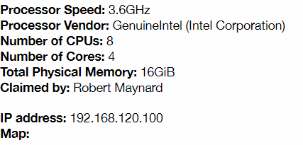
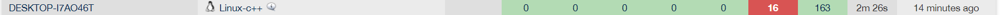
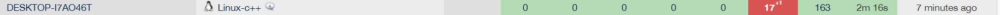
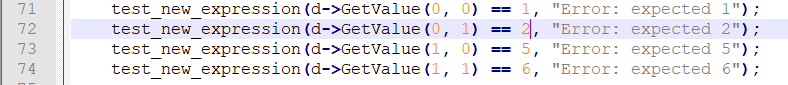
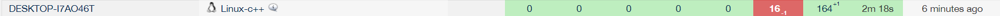

# Lab 8

## Checkpoint 1

Here is an image of WSL running make -j4. I don't know how long it'll take, so it's still in progress.

## Checkpoint 2

You can find tests by clicking on the pictured locations.

You can look at the individual error cases, and it will show you the standard error output for it. This gives you a pretty good spot to start debugging.

I found this one, which has a fairly similar system as mine. I think it has a pretty clean dashboard, since there are no actual errors.

Here's my results on the dashboard.

For some reason, it runs over 179 tests, and fails 16 of those. I don't really know why it runs more tests at all, and I don't know how to go about fixing errors in this code. 

## Checkpoint 3

The dashboard gives the error: "Error: expected 2"

## Checkpoint 4

The issue is the line "test_new_expression(d->GetValue(0, 1) == 4, "Error: expected 2");" says == 4, when it should say == 2. 

## Checkpoint 5

Project Name: Schedj

Link: https://rcos.io/projects/schedj/schedj-frontend/profile

Blog: https://github.com/alanjoy396/Schedj-Blog-for-Open-Source/tree/master/Blog%20Posts

GitHub Repo: https://github.com/Schedj

Collaborators: Kevin Roughan, Gregory Saini, Daniel Molzahn